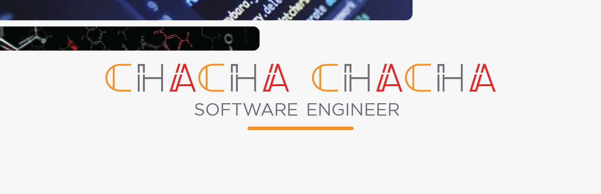

  
  

### 
I'm Chacha, a Software Engineer 👨‍💻 with a great interest in Back End Development. 
  
  

- 🔭 I’m currently working on [My Portfolio]()  
  

- 🌱 I’m currently learning Web3 and K8s  
  

- ❓ Ask me about anything related to Python stack and related technologies  
  

- ⚡ Fun fact:   
  

   

## My Skill Set  
<table><tr><td valign="top" width="33%">

### Frontend  

  
  
  
  
  
  
  
  
  
  
  
  

</td><td valign="top" width="33%">

### Backend  

  
  
  
  
  
  
  
  
  
  
  
  

</td><td valign="top" width="33%">

### DevOps  

  
  
  
  
  
  
  

</td></tr></table>  

   

## Connect with me 

  

  
  

   

## Github Stats  

  

 

  

   

## Recent Blog Posts  
<!-- BLOG-POST-LIST:START -->  
If things goes well, this section should automatically be replaced by a list of your blog posts after you commit your readme file. 
<!-- BLOG-POST-LIST:END -->  

   

  
  

   

---

            
            
                
            

 

